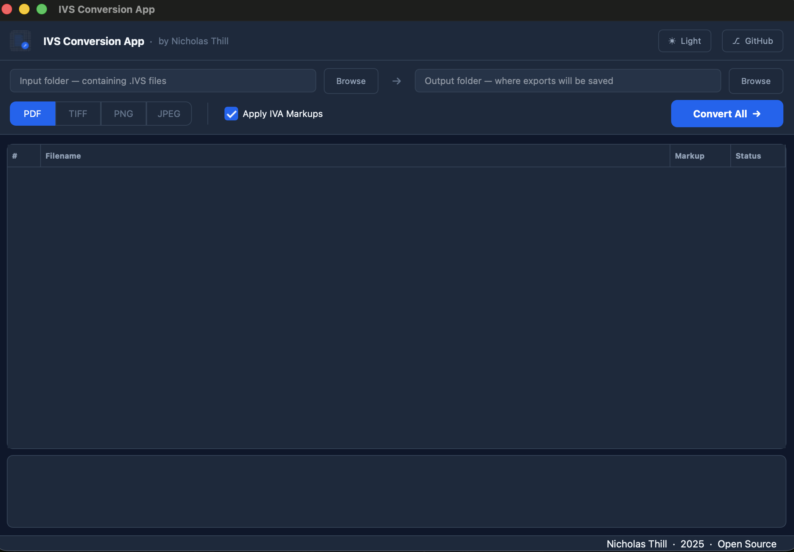

# IVS Conversion App

A fast, free batch export tool for **Ipin Viewing System (IVS)** blueprint files. Convert `.IVS` blueprints — with or without `.IVA` markup overlays — to **PDF, TIFF, PNG, or JPEG** in one click.

Built for construction and engineering professionals who need blueprints in a shareable format for Google Drive, field teams, or archiving.



---

## Features

- **Batch convert** an entire folder of `.IVS` files at once
- **IVA markup overlay** — automatically composites redline annotations onto the base blueprint
- Export to **PDF, TIFF, PNG, JPEG**
- Live per-file status — see each file convert in real time
- Dark / Light mode toggle
- Runs on **macOS and Windows**

---

## Background

[Ipin Viewing System (IVS)](https://ivs.bxohio.com/) is a legacy Windows application used by contractors and engineers to view and mark up blueprints. Its native export function is slow, unreliable, and lacks batch support.

This tool reverse-engineers the `.IVS` and `.IVA` file formats to provide a fast, modern export pipeline:

- **`.IVS`** files are standard TIFF images with a renamed extension
- **`.IVA`** files are text-based markup overlays containing polylines, revision markers, and annotation objects stored in a custom coordinate space that maps 1:1 to the image pixels

---

## Requirements

- Python 3.10+
- PyQt6
- Pillow
- reportlab

---

## Installation (Run from Source)

```bash
git clone https://github.com/nickthill13/ivs-conversion-app.git
cd ivs-conversion-app
pip install -r requirements.txt
python main.py
```

---

## Usage

1. Click **Browse** next to *Input Folder* and select a folder containing `.IVS` files
2. Click **Browse** next to *Output Folder* and choose where exports will be saved
3. Select an export format — **PDF, TIFF, PNG, or JPEG**
4. Toggle **Apply IVA Markups** on or off
5. Click **Convert All**

Files will show a live status as they convert:

| Icon | Meaning |
|------|---------|
| ⏳ | Converting |
| ✓ | Done |
| ✕ | Failed |

A green **IVA** badge next to a file means a matching markup overlay was found and will be composited automatically.

---

## Packaged Releases

Standalone downloads (no Python required) coming soon for **macOS** and **Windows**.

---

## License

MIT License — free to use, modify, and distribute with credit.

See [LICENSE](LICENSE) for full terms.

---

Built by [Nicholas Thill](https://github.com/nickthill13)
